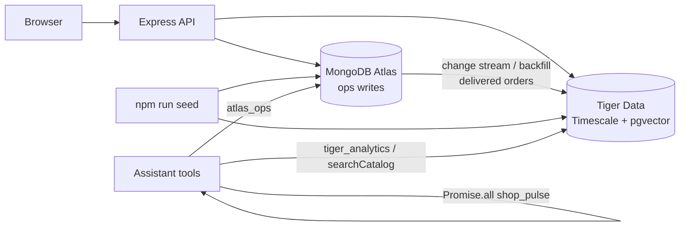

# Nivara — Architecture

One question drives everything: **"What needs my attention in my business today?"**

## Shape

```
browser (public/: plain HTML + JS, no build)
   │  fetch /api/*
   ▼
Node 26 server (src/server.ts, Express, runs .ts natively — no build step)
   ├─ src/logic.ts        PURE deterministic rules: forecast fallback, stockout, reorder,
   │                      order matching, date resolution  (unit-tested in test/)
   ├─ src/db.ts           MongoDB (Atlas if MONGODB_URI, else local docker mongo)
   ├─ src/ops.ts          business operations = tools = Temporal activities
   │                      (inventory, pending orders, forecast, suppliers, memory, brief)
   ├─ src/agent.ts        Gemma via Ollama OpenAI-compatible API
   │                      Mastra Agent + tools → Gemma JSON router → keyword router
   │                      order extraction (Gemma JSON → zod → deterministic match)
   ├─ src/integrations.ts SerpApi, Backboard, ElevenLabs, TabPFN subprocess,
   │                      Sentry + local trace store
   └─ src/temporal/       workflows + worker + schedule (fallback: direct activity run)
forecast/forecast.py      TabPFN regressor (py3.11 venv), JSON stdin → JSON stdout
```

## Rules of the road

- **Gemma does language**: intent / tool selection (validated JSON), order extraction, open-ended answers,
  the brief's 1–2 sentence summary.
- **Code does facts**: DB writes, validation (zod), stock maths, dates, workflow state, and the final wording of
  every standard answer (deterministic templates in `agent.ts`: restock, why at risk, pending orders, best
  sellers, suppliers, memory, brief). Gemma only sees those readable facts, never raw JSON, and its text is
  dropped if it leaks field names. `answerMode` (`template` / `template+gemma` / `gemma`) is on every response.
- **Mastra**: Gemma handles reasoning and structured tool intent, while a validated JSON router provides
  deterministic tool invocation; Mastra defines the agent and tools.
- Every external dependency has a labelled fallback, surfaced in `/api/health` and the UI:

| Concern        | Live                         | Fallback (labelled)                    |
|----------------|------------------------------|----------------------------------------|
| LLM            | Gemma via Ollama             | keyword router + template text         |
| Tool calling   | Mastra agent native tools    | Gemma JSON router → keyword router     |
| Forecast       | TabPFN (`method: tabpfn`)    | `fallback-moving-average`              |
| Supplier search| SerpApi via Temporal refresh → `supplierPrices` cache | "Stored quote" from DB only |
| Memory         | Mongo rules + Backboard save/search | Mongo only, labelled            |
| Voice          | ElevenLabs Scribe + TTS (key verified) | browser Web Speech API, notice on failure |
| Workflows      | Temporal (worker + schedule) | activities run in-process (`direct`)   |
| Tracing        | Sentry gen_ai spans + local  | local trace store only                 |

## Why two databases (Atlas + Tiger)

Atlas and Tiger are **complementary**, not overlapping copies of the same rows.

| Store | Owns | Why |
|---|---|---|
| **MongoDB Atlas** | Orders, customers, chats/voice extractions, agent memory, product ops fields (stock, supplier) | Document model + change streams; source of truth for **writes** |
| **Tiger Data** | `sales_daily` hypertable, 7d/28d continuous aggregates, pgvector + FTS catalog search | Time-series + vector search; source of truth for **analytics / demand / catalog retrieval** |



Sync: when an order becomes `delivered`, Atlas change stream (or periodic backfill) upserts lines into Tiger `order_sales` keyed by `(orderId, sku)` and bumps `sales_daily`. Proxy demand series also live in `sales_daily` with `source:"proxy"`.

## Data (Mongo collections)

`products` (sku, name, aliases, price, cost, stock, supplierId, leadTimeDays, productType, priceSource),
`customers`, `orders` (status pending/delivered, items, deliveryDate),
`sales` (daily history; `source: proxy|order`), `suppliers` (name, quotes per sku),
`preferences` (memory), `briefs` (workflow output), `traces` (local spans),
`supplierPrices` (latest SerpApi result per SKU, written only by the Temporal refresh).
Real seed docs are not `demo: true`; `npm run seed:demo` still marks demo.

## Checklist

- [x] Plan
- [x] Vertical slice: dashboard → Gemma → Mongo → inventory → answer
- [x] Order extraction with confirmation
- [x] Forecast (TabPFN v2 live + labelled fallback) + tests
- [x] Supplier search (SerpApi, key-gated) + memory filter (Mongo; Backboard key-gated)
- [x] Voice (ElevenLabs key-gated / Web Speech fallback)
- [x] Temporal workflows + schedule + retry demo
- [x] Mastra agent + Gemma JSON router + keyword router
- [x] Sentry spans + local trace view
- [x] render.yaml, docs (not deployed)

## Why these shapes

- **One tool table** (`agent.ts`) feeds Mastra `createTool`, the Gemma JSON router, the keyword router and
  `templateAnswer`. Temporal activities call the same `ops.ts` functions. No duplicated business logic.
- **Templates for structured answers**: given JSON, the 4B model dropped list items, swapped supplier
  from/to, confused available vs total stock and echoed keys ("Demand7: low risk"). Structured questions now get
  deterministic templates; Gemma is kept for routing, extraction, open-ended questions and the brief summary.
- **Attention threshold**: a supplier saving counts only if ≥ ₹10/unit AND ≥ 5% (`bestQuote` in `logic.ts`).
- **Forecast cached per day**, invalidated when an order is created or delivered (reserved stock changes).
