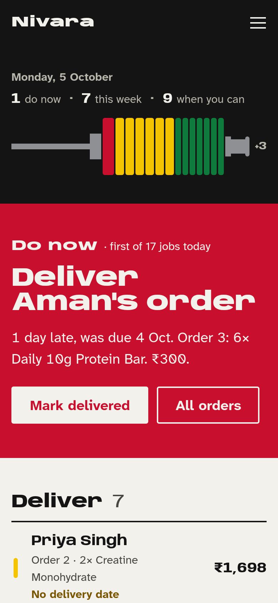
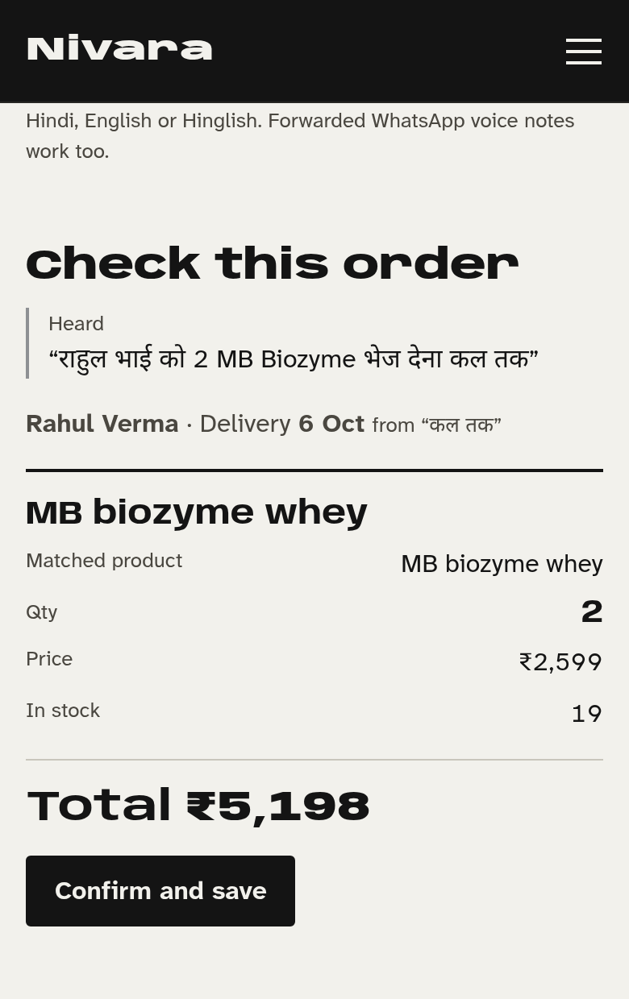
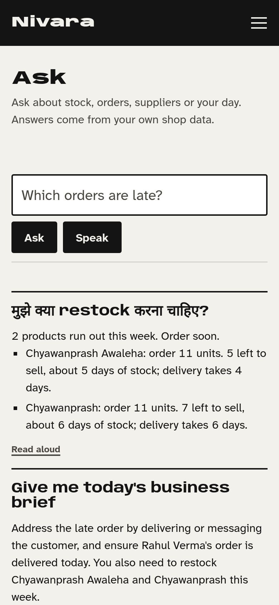
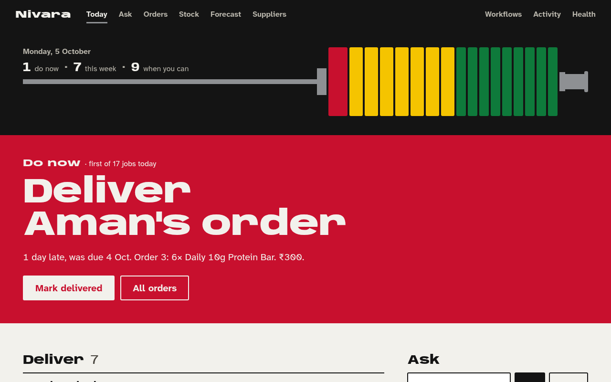
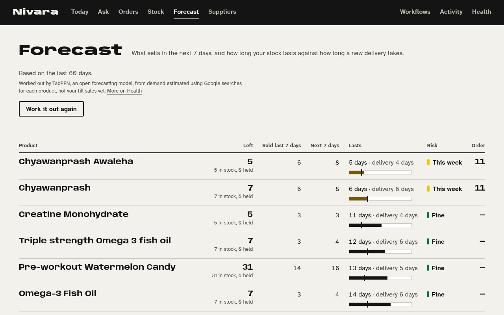
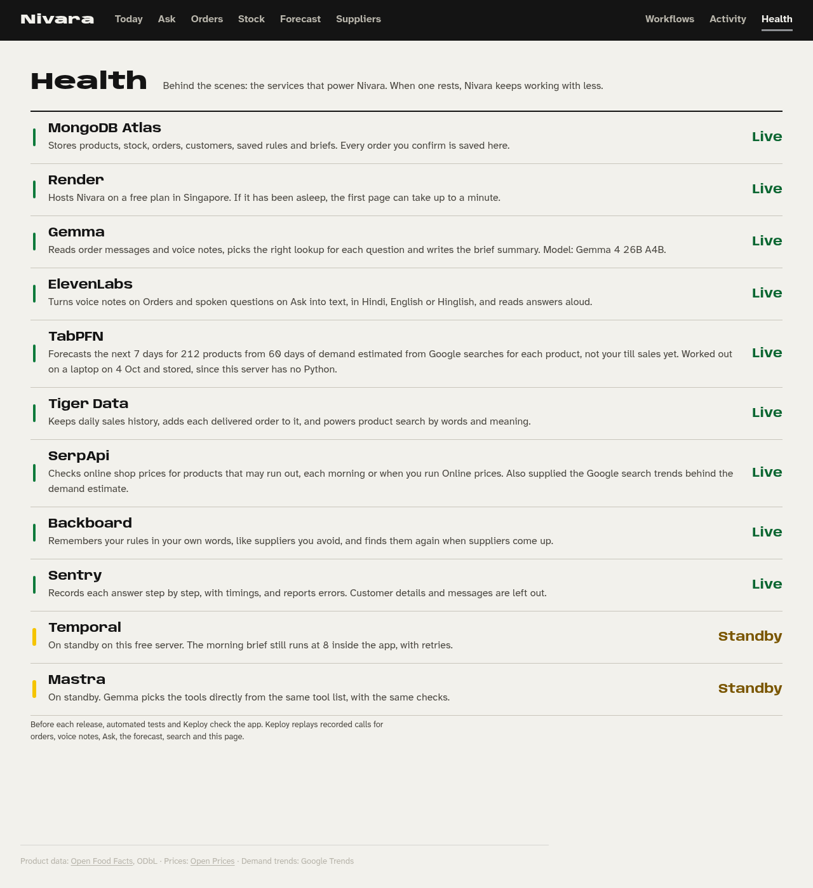
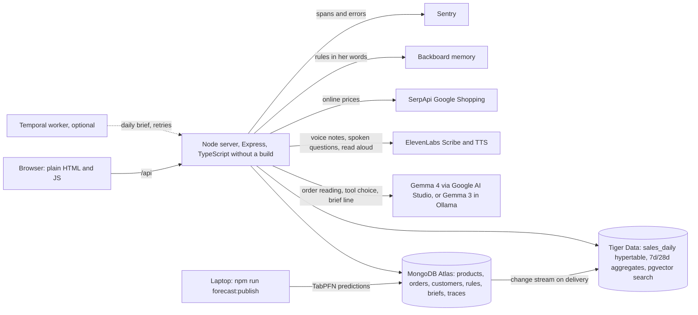

# Nivara

A shop helper for one friend's supplements business, run from her phone.

**Live:** https://nivara-x9iv.onrender.com (free Render plan; after a quiet spell the first page can take up to a minute)

> "What needs my attention in my business today?"

| Today on a phone | Voice note → order | Ask, in Hinglish |
|---|---|---|
|  |  |  |

## Who it is for

My friend sells protein, whey, creatine and chyawanprash on her own, through WhatsApp and Instagram. Orders arrive
as chat messages and Hinglish voice notes ("Rahul bhai ko 2 MB biozyme whey bhej dena kal tak"). Stock lives in her
head, and she finds out a product has run out when a customer asks for it. Each morning she needs three answers:
what to deliver, what to reorder before it runs out, and whether a supplier is charging too much.

## What it does

- **Today.** One list of jobs, heaviest first: late and due orders, products that run out before a new delivery
  can arrive, and supplier savings worth acting on (at least ₹10 and 5% a unit). Each order can be marked
  delivered from here. A morning brief is written at 08:00 IST.
- **Orders from a voice note or a message.** Record a voice note, upload a forwarded WhatsApp one (`.opus`, `.ogg`,
  `.m4a`, `.mp3`, `.wav`, `.aac`, `.webm`), or paste the chat text. The page shows what it heard, the matched
  customer, products, prices and delivery date (कल, आज, परसों, kal, parson, weekdays). Nothing is saved until she
  taps **Confirm and save**. Orders get short numbers (Order 1, 2, 3).
- **Mark delivered.** Takes the units off stock, records the sale in MongoDB and adds it to the sales history in
  Tiger Data, so the next forecast learns from it.
- **Ask.** Typed or spoken questions in English or Hinglish: what to restock and why, pending orders (or one
  customer's orders), best sellers, cheaper suppliers, catalogue search ("MuscleBlaze whey under 3000"), saved
  rules. Answers can be read aloud.
- **Stock and Forecast.** All 212 products with stock, price, cost, supplier and delivery time; a 7-day forecast,
  days of stock against delivery time, risk and how many to order. Long lists draw 30 rows first and the rest as
  she scrolls.
- **Suppliers.** Stored quotes compared with what she pays, an online price check, and rules she wants kept
  ("I never buy from Supplier C"), which then filter supplier suggestions.
- **Behind the scenes.** Workflows (run a job now), Activity (each answer step by step with timings) and Health
  (each service Live or Standby, in plain words).
- **Phone first.** Below 900px the page links move behind a menu button; every tap target is at least 44px.

Not built on purpose: login, payments, a WhatsApp Business connection, a native app.

| Laptop: Today | Laptop: Forecast | Laptop: Health |
|---|---|---|
|  |  |  |

## How it works



**Gemma does language, code does facts.** Gemma reads orders out of messages and transcripts, picks which lookup
answers a question, and writes the one-line summary of the brief. Stock maths, risk rules, dates, prices, matching
and every database write are plain code with tests. Gemma output is validated with zod before use; it never
writes to the database. Standard questions are answered from templates built on tool output, so numbers on Ask
match Today, Stock and Forecast.

Two databases with different jobs: MongoDB Atlas is where writes happen; Tiger Data holds sales history as a time
series and serves catalogue search (full text plus `gemini-embedding-001` vectors). A delivered order reaches Tiger
through an Atlas change stream, keyed by order and product, on the shop's day (Asia/Kolkata).

Every outside service has a fallback: no Gemma means keyword routing and template answers; no TabPFN run means a
labelled 7-day average; no Temporal means jobs run inside the app (the 08:00 brief included, with retries); no
ElevenLabs key turns voice notes off and Ask uses the browser's own speech. Health shows which is in use.

More: [docs/ARCHITECTURE.md](docs/ARCHITECTURE.md), [docs/PRODUCT.md](docs/PRODUCT.md), [docs/DATA.md](docs/DATA.md),
[docs/DESIGN.md](docs/DESIGN.md).

## Partners

| Partner | Used for | Live on Render |
|---|---|---|
| Gemma (`gemma-4-26b-a4b-it`) | order reading from text and voice transcripts, tool choice, brief summary | Live |
| MongoDB Atlas | operational data and every confirmed order | Live |
| Tiger Data | sales history, delivered-order sync, hybrid product search | Live |
| TabPFN | 7-day forecast for all 212 products, published from a laptop | Live (stored run) |
| ElevenLabs | Scribe speech to text for voice notes and Ask, text to speech | Live |
| SerpApi | Google Shopping prices; Google Trends for the demand estimate | Live |
| Backboard | rules saved in her words and searched back for supplier decisions | Live |
| Sentry | step-by-step spans for answers and jobs, error capture, content redacted | Live |
| Render | hosting (free web service, Singapore) | Live |
| Keploy | 15 recorded API calls replayed as tests | Used in testing |
| Temporal | scheduled jobs with retries (verified locally) | Standby |
| Mastra | agent and tool definitions; native tool calls for models that support them | Standby |

Details and how each was checked: [docs/PARTNER-INTEGRATIONS.md](docs/PARTNER-INTEGRATIONS.md).

## Run it locally

Needs Node 24.2 or newer and either Docker (local MongoDB) or a MongoDB Atlas URI. Every API key is optional.

```bash
git clone https://github.com/CodewithJha/nivara.git && cd nivara
npm install
cp .env.example .env     # set MONGODB_URI to use Atlas instead of Docker
npm run db               # MongoDB 8 in Docker on :27017 (skip with Atlas)
npm run seed             # catalogue, prices and demand from the cached files in data/real
npm start                # http://localhost:3000
```

Gemma: run Ollama (`ollama pull gemma3:4b`, the default) or set `LLM_PROVIDER=gemini` and `GEMINI_API_KEY` for
`gemma-4-26b-a4b-it` from Google AI Studio.

| Script | What it does |
|---|---|
| `npm test` | 137 tests: stock, risk and date rules, Hinglish order parsing, answers and copy, voice-note UI, phone menu, lazy rows, partner paths with mocked `fetch`, Sentry redaction (uses the `nivara_test` database) |
| `npm run forecast:setup` | TabPFN in `forecast/.venv` (Python 3.11, pulls torch) |
| `npm run forecast:publish` | runs TabPFN on this machine and stores the predictions in MongoDB for a host without Python |
| `npm run reprice` | recomputes estimated prices in MongoDB and Tiger after changing the price rules |
| `npm run data:catalog` / `data:prices` / `data:trends` / `data:demand` | refresh the source data from Open Food Facts, Open Prices and Google Trends |
| `npm run import:orders` | import her own orders from CSV or a WhatsApp export |
| `npm run sync:tiger` | backfill delivered orders into Tiger |
| `npm run temporal:dev`, `npm run worker` | Temporal dev server and worker with the daily schedule (`SUPPLIER_FAIL_FIRST_N=2` shows retries) |
| `npm run services -- status` | start, stop or restart server, worker and Temporal in `screen` sessions |

Keploy: `keploy.yml` and `keploy/real-data-partners-1/` hold 15 recorded calls (health, dashboard, forecast,
Ask, order reading, voice, catalogue search) that replay against a local server with `keploy test`.

## Environment variables

| Var | Used for | Without it |
|---|---|---|
| `MONGODB_URI`, `MONGODB_DB` | data (default `mongodb://localhost:27017`, db `nivara`) | pages that read data fail; Health shows MongoDB down |
| `LLM_PROVIDER` | `ollama` (default) or `gemini` | Ollama |
| `GEMINI_API_KEY`, `GEMINI_MODEL` | Gemma through Google AI Studio, embeddings for hybrid search | keyword routing, full-text search only |
| `OLLAMA_BASE_URL`, `GEMMA_MODEL` | Gemma through Ollama (default `gemma3:4b`) | keyword routing and templates; order reading returns an error |
| `TIGER_DATABASE_URL` | Tiger Data history, sync and search | MongoDB sales and keyword search |
| `ELEVENLABS_API_KEY` | voice notes, spoken questions, read aloud | voice notes off; browser speech on Ask |
| `SERPAPI_API_KEY` | online prices (`SUPPLIER_REFRESH_MAX` products per run, default 5) | stored quotes only |
| `BACKBOARD_API_KEY` | rules mirrored to and searched in Backboard | rules in MongoDB only |
| `SENTRY_DSN` | spans and errors (`SENTRY_SEND_CONTENT=1` to include text) | local traces only |
| `TEMPORAL_ADDRESS`, `TEMPORAL_NAMESPACE`, `TEMPORAL_API_KEY` | Temporal workflows | jobs run in the app |
| `FORECAST_MODE=fallback` | do not start TabPFN in this process | TabPFN runs if installed |
| `FORECAST_RUN_MAX_AGE_HOURS` | how long a published TabPFN run is used (default 720, 30 days) | 7-day average after that |
| `MIN_SUPPLIER_SAVING_RUPEES`, `MIN_SUPPLIER_SAVING_PERCENT` | when a cheaper quote counts (default ₹10 and 5%) | defaults |
| `BUSINESS_TZ` | the shop's day (default `Asia/Kolkata`) | default |

Full list in [.env.example](.env.example).

## Deploy on Render

`render.yaml` describes one free web service in Singapore: Node 24, `npm ci`, `npm start`, health check
`/api/health`, `LLM_PROVIDER=gemini`, `GEMINI_MODEL=gemma-4-26b-a4b-it`, `FORECAST_MODE=fallback`. Secrets go in the
Render dashboard: `MONGODB_URI` (allow `0.0.0.0/0` in Atlas, free Render has no static IP), `GEMINI_API_KEY`,
`TIGER_DATABASE_URL`, `ELEVENLABS_API_KEY`, `SERPAPI_API_KEY`, `BACKBOARD_API_KEY`, `SENTRY_DSN`.

```bash
render deploys create <service-id> --commit <sha> --wait
```

Render has no Python, so the live forecast is the latest TabPFN run published from a laptop (`npm run
forecast:publish`); Health names the day it was worked out. There is no Temporal worker on Render, so the app
writes the 08:00 brief itself. `.github/workflows/keep-alive.yml` pings `/api/health` every 10 minutes until
15 Oct 2026 so the free service stays awake during judging.

## Data

212 real products from Open Food Facts India (ODbL), 4 observed prices from Open Prices and estimated prices for
the rest, and daily demand estimated from Google Trends search interest. The demand is an estimate, not till sales;
the app says so on Forecast and Health. Her confirmed and delivered orders are added to the history as they happen.
See [docs/DATA.md](docs/DATA.md).

## Limitations

- Demand is estimated from search interest until there are weeks of her own sales.
- Most prices are estimates until she enters her own costs.
- Online prices are retail listings; pack sizes are not normalised, so the page says to check them.
- Some catalogue names come straight from Open Food Facts (lowercase, near duplicates).
- One shop, no login.

## Next

- Read orders straight from WhatsApp Business (the reading path already takes the raw text).
- One tap from "order 11" to a message for the supplier.
- Refit TabPFN on her real sales once there are a few weeks of them.
