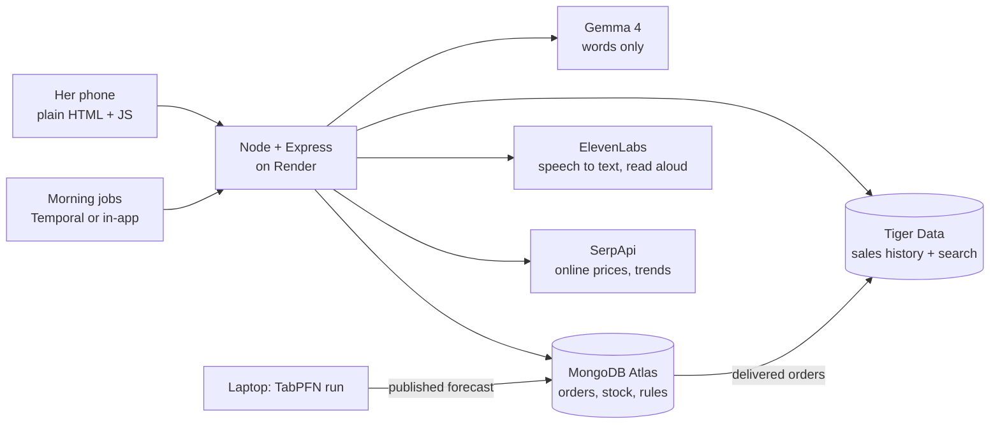

*This is a submission for the [Hacktoberfest Weekend Challenge: Build for a Friend](https://dev.to/challenges/hacktoberfest-weekend-2026-10-01)*

## Her day, before Nivara

My friend runs a supplements shop on her own. No staff, no shop counter, no software. Just her phone.

Orders come in as WhatsApp messages and voice notes, mostly in Hindi or Hinglish. "Bhai 2 whey protein bhej dena kal." "One creatine monohydrate please, deliver Friday." She keeps the stock count in her head. Most weeks that works. Then a best-seller runs out, and the way she finds out is a customer asking for it.

When I asked her what she actually wanted, it wasn't a chatbot. It was three answers every morning:

1. What do I deliver today?
2. What do I reorder before it runs out?
3. Am I paying a supplier more than I need to?

So that's what I built.

## What Nivara does

Nivara is a small web app she can open on her phone between chats. On a phone the pages sit behind a menu button at the top right, so the screen is all hers.

**Today** answers the morning question first. The top of the screen is a loaded barbell. Every job is a plate, heaviest first, and the plate colour tells you how urgent it is, the same way competition bumper plates tell a lifter the weight from across the gym. Red is "do this now", yellow is "this week", green is "when you have a minute". Below that, the single heaviest job gets the whole width of the screen with one button to act on it.

**Orders** turns a voice note or a pasted chat message into a draft order. Most of her orders arrive as voice notes, so the page has a Record button and an Upload button for a forwarded WhatsApp note. I uploaded a short Hinglish clip to the live site. It showed what it heard, "राहुल भाई को 2 MB Biozyme way भेज देना कल तक", and came back with Rahul Verma as the customer, 2 × MB biozyme whey at ₹2,599, a ₹5,198 total, and delivery on 6 Oct, worked out from "कल तक". The "bhai" is ignored when matching the name, and "way" still finds the whey. Nothing is saved until she taps "Confirm and save". Pasting text works the same way.

**Ask** takes typed or spoken questions in English or Hinglish: "What should I restock?", "Rahul ka order kab deliver karna hai?", "Remember that I don't buy from Supplier C", or a product search like "MuscleBlaze whey under 3000". Answers can be read aloud. I spoke "मुझे क्या restock करना चाहिए?" into it and got the same two products, with the same order quantities, that Today and Forecast show.

**Stock**, **Forecast** and **Suppliers** cover the rest: what's on the shelf, what sells in the next 7 days against how long a delivery takes, and which stored quotes or online prices are cheaper. Forecast says at the top where its numbers come from: "Worked out by TabPFN, an open forecasting model, from demand estimated using Google searches for each product, not your till sales yet." A cheaper quote only counts if it saves at least ₹10 a unit and at least 5%, so she isn't nagged about switching suppliers to save ₹3.

There's also a morning brief: who to deliver to, what runs out this week, where she can pay less, and her best seller. It's ready at 8 every morning. With a Temporal worker that's a Temporal schedule; on the free Render deploy there's no worker, so the app writes it itself at 8 and tries again ten minutes later if anything fails. She can also tap "Make a fresh brief".

## Demo



Live: https://nivara-x9iv.onrender.com (free Render plan, so the first open can take 30 to 60 seconds while it wakes up).

## The one rule: Gemma does language, code does facts

A shop helper that confidently tells you the wrong stock number is worse than no helper. So I drew a hard line early.

**Gemma reads and writes words.** It reads her order messages and voice-note transcripts and turns them into JSON. It picks which lookup a question needs. It writes the one or two sentence summary at the top of the morning brief, and answers open-ended questions.

**Code owns every fact.** Stock, reserved units, days of cover, stockout risk, reorder quantity, supplier savings and dates are plain TypeScript over the database, with tests. "Kal", "कल", "aaj" and "parson" become dates in code, not in the model. Gemma never writes to the database.

In practice:

- Gemma's order JSON is checked with zod. If it's broken, Gemma gets one retry with the error, then the request fails cleanly.
- The draft is matched to real products and customers by code, then shown to her. The only way an order gets saved is the confirm button, which validates again and checks every product exists.
- Standard questions (restock, pending orders, best sellers, suppliers, saved rules) are answered by templates built from the tool output. I started by letting a small Gemma write those answers and it dropped list items, swapped supplier names and mixed up available and total stock. Templates fixed that. Gemma still writes free-form answers, but only from facts the code already checked, and the answer is thrown away if it leaks field names.
- If Gemma is unreachable, a keyword router picks the tool and the answer still comes from her data.

Every question and background job is logged with its steps and timings. She never sees that on her pages, but it's one tap away under Behind the scenes (Activity and Health).

## How it fits together

One Node server, no build step, and a frontend that is one HTML file and a few small JS files. The same tool functions are used by the assistant, the dashboard and the scheduled jobs, so there's one copy of the business logic. Long lists on Stock and Forecast draw the first rows straight away and the rest as she scrolls, and the scripts and fonts are cached, so it stays quick on a phone.

## Why an open model

Her customers' names, their phone-chat orders and her margins are not data I want to ship to a closed API by default.

On the live site Nivara uses Gemma 4 (`gemma-4-26b-a4b-it`) through the Google AI Studio free tier, because a free Render box can't run a model. But the same app runs against Gemma in Ollama with one environment variable, and I developed most of it against `gemma3:4b` on my laptop. If she wants her data to stay on her own laptop, it can. It costs nothing per message and doesn't depend on any vendor's pricing.

Using a small open model also kept me honest. It can't be trusted with numbers, so the design never asks it for any.

## The data, and what's not real

I don't have her actual sales history yet, and there is no open dataset of Indian supplement sales. So I built the most honest stand-in I could:

- **Catalogue:** 212 supplement products from the Open Food Facts India database (ODbL). These are real Indian products, with real brands and names. The data is messy in the way real data is: a few Chyawanprash jars made it into the list.
- **Prices:** Open Prices (ODbL) had observed INR shelf prices for only 4 of those products. The others are estimates from pack size, product type and a brand-tier price band, and they're marked `manual` in the data. My first pass priced 7 whey tubs as if they were sachets (Biozyme Performance Whey at ₹139). I fixed the pack-size rules and repriced the live data, so that tub is now ₹2,749. Treat the estimates as placeholders until she enters her own.
- **Demand:** Google Trends search interest for India (pulled through SerpApi), scaled down to what a solo shop might sell, about 200 units a week. This is a stand-in for demand, not sales. Every one of those rows is tagged `proxy` in the database, and the Forecast page says so in one line.
- **Orders:** a handful of sample WhatsApp-style orders, imported through the same path her real chat exports would use.

When she starts confirming and delivering orders, those real sales flow into the same history and the stand-in matters less.

## The partners, and what each one really does

- **Gemma.** The language layer described above: order extraction from text and voice-note transcripts, tool choice, the brief's summary line and open-ended answers.
- **Render.** Hosts the app from a `render.yaml` blueprint: one free web service in Singapore, health-checked on `/api/health`. I deploy with the Render CLI. A GitHub Actions job pings the health check every 10 minutes until 15 Oct so judges don't land on a cold start.
- **MongoDB Atlas.** The source of truth for anything she writes: products, stock, customers, orders, saved rules, briefs and the activity log. It's a free M0 cluster in Mumbai.
- **Tiger Data.** Daily demand lives in a Timescale hypertable with 7-day and 28-day continuous aggregates. Catalogue search is hybrid: Postgres full-text plus pgvector over `gemini-embedding-001` embeddings, with hard filters like "under ₹3000" applied to both. When an order is marked delivered in Atlas, its lines sync into Tiger, keyed by order and product so a repeat sync doesn't double count. "How is the business doing" questions read Atlas and Tiger in parallel.
- **TabPFN.** TabPFN v2 forecasts 7-day demand per product from 60 days of history. Render has no Python, so I ran it on my laptop over all 212 products (317 seconds on CPU, in chunks of 50) and published the predictions to Atlas. The live app uses the newest published run for up to 30 days (Health shows the day it was worked out), then falls back to a moving average that is labelled as such. Stock and risk are still worked out live, and "next 7 days", days of stock, risk and how many to order all come from that one forecast, so every page gives the same answer.
- **SerpApi.** Google Shopping prices for at-risk products (shown as "Online prices", with a reminder to check pack size), and the Google Trends data behind the demand estimate.
- **ElevenLabs.** Scribe turns speech into text. The Record and Upload buttons on Orders send the voice note to Scribe, and the transcript goes through the same Gemma extraction and code checks as a pasted message. The Speak button on Ask uses the same transcription. Answers can be read aloud with ElevenLabs text to speech. If it fails, the browser's own voice takes over quietly.
- **Temporal.** The morning brief, low-stock check, forecast and online-price refresh are Temporal workflows on an 08:00 IST schedule, with retries and exponential backoff. Locally I tested a forced supplier outage (fails twice, succeeds on attempt 3) and a script that kills the worker mid-run and shows the workflow resume. On free Render there's no worker, so the same jobs run inside the app with the same retry loop (including the 8 o'clock brief), and Health shows Temporal on standby.
- **Sentry.** Each question is traced as a gen_ai agent span with child spans for the model call and each tool, so I can see where an answer was slow. Prompts, answers and customer data are redacted to a character count before they leave the server.
- **Backboard.** Remembers her rules in her own words, like "I don't buy from Supplier C", and searches them back when suppliers come up. MongoDB still holds the structured rule and stays the source of truth.
- **Mastra.** Defines the agent and its ten tools. Gemma picks the tool by returning JSON that is checked against the same tool table. Mastra's native tool calling only switches on for models that advertise it in Ollama, so on the live site Health shows it on standby.
- **Keploy.** 15 recorded API test cases (health, dashboard, forecast, catalogue search, assistant, order extraction and voice) that replay against the server. Alongside them there are 137 unit and integration tests, including Hinglish order parsing, the voice-note flow, the phone menu and the forecast numbers.

## Making it hers

The first version worked, but it was built for me. It talked about answer modes and trace IDs and "16 things need your attention". So I did a pass where I read every screen as her:

- Plain shop words. "3 orders to deliver today", rupees with Indian grouping, "Order 4" instead of a database ID.
- No model names, trace IDs or partner names on her pages. That all moved to Behind the scenes, where Health lists each service as Live or Standby in one plain sentence. The one exception is the Forecast line, because she should know those numbers come from Google searches and not her own sales.
- Every error says what happened in normal words and has a Retry button.
- Voice fails quietly. If the microphone is off or ElevenLabs is down, she gets one line telling her to upload the note or type instead.
- On a phone, a menu button at the top right opens the full page list, and every button is big enough to hit with a thumb between chats.
- The example questions on Ask only read. Tapping one never saves a rule, so nobody blocks a supplier by accident.

The design came from the gym she sells to: chalk-white background, rubber-black bands, steel grey for the bar, and the three plate colours used only to mean how heavy a job is. Plate thickness carries the same meaning, so colour is never the only signal. The headings use Anybody, a wide heavy font that reminds me of the raised lettering on a bumper plate, and the body text uses Atkinson Hyperlegible so that 1, l and I never get confused in a quantity.

## Checking it the way she'd use it

Before handing it over I clicked through every page and button on the live site, on a 360 and 390 px phone and on a laptop, and checked each change in the databases rather than trusting the screen. Saving an order had to create it in Atlas. Marking it delivered had to take two tubs off the shelf (21 to 19), record the sale, and add a row to the Tiger sales history. That pass found real bugs:

- Today said to reorder 11 of a product while Ask said 7. One path used the forecast and the other used last week's sales. Now every page uses the forecast.
- "Cheapest online" picked a ₹197 sachet for a ₹6,949 tub of whey. An online price now has to share a brand word and sit within half to double her price.
- Orders showed numbers like "Order 27" made from database ids. They're now Order 1, 2, 3.
- Times showed "2:38 am" because the server runs on UTC. Everything is shown in India time now, and delivered sales land on the shop's day.
- Voice notes with background music came back with "[outro jingle]" in the transcript. Sound tags are now off, and a note that is only music counts as silence.
- Health still described an older version of the app. It now says what each service does today, in one plain line each.

## What I'd do next

- Read orders straight from WhatsApp Business instead of forwarding voice notes or pasting text. The extraction path is ready for it.
- One tap from "order 11 more" to a message to the supplier.
- Normalise pack sizes so an online price for a 500 g tub isn't compared with a 1 kg wholesale cost.
- Replace the demand estimate with her real sales once she's used it for a few weeks, and rerun TabPFN on that.

## Prize Categories

Best Use of Gemma, Best Use of TabPFN, Best Use of Render, Best Use of MongoDB Atlas, Best Use of Tiger Data, Best Use of ElevenLabs, Best Use of SerpApi, Best Use of Sentry Agent Tracing, Best Use of Backboard, Best Use of Temporal, Best Use of Mastra.

## Links

- Repo: https://github.com/CodewithJha/nivara
- Live app: https://nivara-x9iv.onrender.com (give it up to a minute on first open)
- Demo video: 

Built by Prakhar ([@CodewithJha](https://github.com/CodewithJha)) for a friend who deserves to stop counting tubs in her head.
